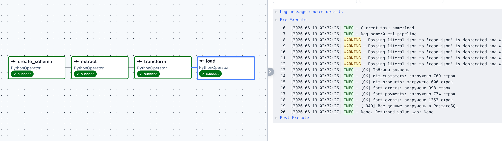

# Блок 3 - ETL-пайплайн: Аналитика данных


## Описание проекта

End-to-end ETL-пайплайн для загрузки, очистки и аналитики данных из разнородных источников (CSV, JSON, XLSX, XML). Оркестрация через Apache Airflow, хранение данных в PostgreSQL.

---

## Структура проекта

```
part3/
├── dags/
│   └── etl_dag.py
├── src/
│   ├── extract.py
│   ├── transform.py
│   └── load.py
├── sql/
│   └── analize.sql
├── ddl/
│   └── schema.sql
├── data/
│   ├── customers.csv
│   ├── orders.json
│   ├── products.xlsx
│   ├── events.xml
│   └── payments.csv
├── logs/
│   └── dq_issues.json 
├── docker-compose.yml
├── requirements.txt
└── README.md
```

---

## Как запустить проект

### 1. Требования

- Docker и Docker Compose
- DBeaver или любой PostgreSQL-клиент

### 2. Запуск Airflow и PostgreSQL через Docker

```bash
docker compose up airflow-init
docker compose up -d
```

После запуска Airflow доступен по адресу: [http://localhost:8080](http://localhost:8080)

### 3. Создание схемы базы данных

Подключиться к ETL-базе в DBeaver:

| Параметр | Значение |
|----------|----------|
| Host | `localhost` |
| Port | `5433` |
| Database | `etl_db` |
| User | `postgres` |
| Password | `postgres` |

> Маппинг прописан в `docker-compose.yml`.

### 4. Запуск DAG

DAG выполняет четыре задачи последовательно:



### 5. Проверка результата

После успешного завершения DAG проверить данные в DBeaver. 

Лог проблем Data Quality сохраняется в `logs/dq_issues.json`.

Аналитические запросы — в файле `./part3/sql/analize.sql`. 

---

## Архитектурные решения

### DWH-модель: Star Schema

Выбрана схема Star Schema как наиболее подходящая для аналитических запросов:

- **Dimension-таблицы** (`dim_`) — справочники: клиенты, товары. Отвечают на вопрос "кто/что".
- **Fact-таблицы** (`fact_`) — события: заказы, платежи, активность. Содержат метрики и ссылки на dimensions.

### Порядок загрузки

Сначала dimensions, потом facts — требование ссылочной целостности (FOREIGN KEY). Нельзя вставить заказ с `customer_id=5`, если клиент с таким ID ещё не загружен.

### Передача данных между задачами Airflow

DataFrame нельзя передать напрямую между задачами — они могут выполняться на разных воркерах. Используется XCom: данные сериализуются в JSON (`df.to_json(orient='records')`), сохраняются в XCom, десериализуются в следующей задаче (`pd.read_json`).

### Data Quality

Проблемные записи логируются в `dq_issues.json` с указанием источника, ID строки и описания проблемы. Принятые решения по каждому типу проблем:

| Проблема | Решение |
|----------|---------|
| `broken-date` в events.xml | Оставляем запись, `event_timestamp = NULL` |
| `customer_id = 999999` в events | Логируем как фантомный ID, запись удаляем |
| `error_amount` в payments.csv | `amount = NULL`, запись сохраняем |
| Невалидная дата `13/45/2025` в payments | Оставляем NULL, логируем — месяц 45 физически невозможен |
| Невалидная дата `32.13.2024` в customers | Оставляем NULL, логируем — день 32 и месяц 13 физически невозможны |
| Заказ с несуществующим `product_id` | Логируем, запись удаляем |
| Префиксы `г-н`, `г-жа` в именах | Удаляем регулярным выражением |
| Смешанный регистр в именах | Приводим через `str.title()` |
| Телефоны в разных форматах | Нормализуем к формату `+7XXXXXXXXXX` |

### Очистка при повторном запуске

Перед каждой загрузкой таблицы очищаются через `TRUNCATE ... RESTART IDENTITY CASCADE`. Это обеспечивает идемпотентность пайплайна — повторный запуск даёт тот же результат.

---

## Стек

- Python 3.10+
- Apache Airflow 2.9
- PostgreSQL 15
- pandas, SQLAlchemy, psycopg2
- Docker, Docker Compose
